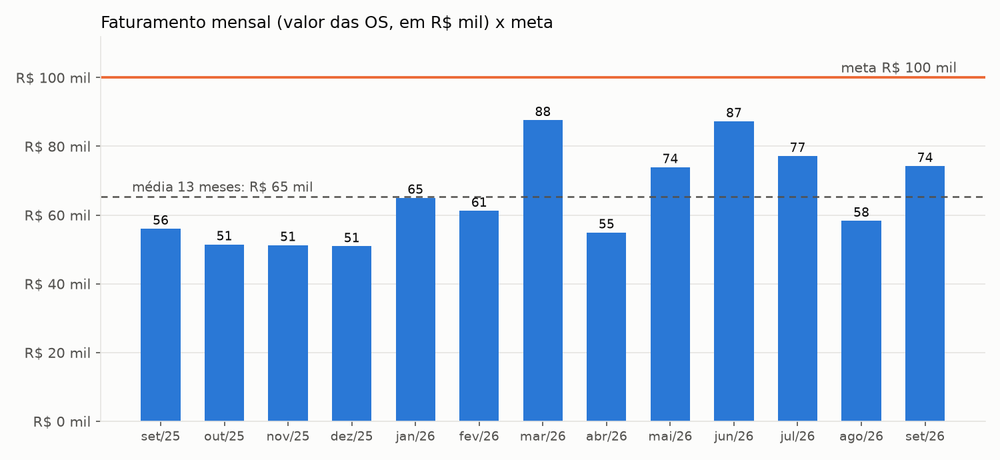
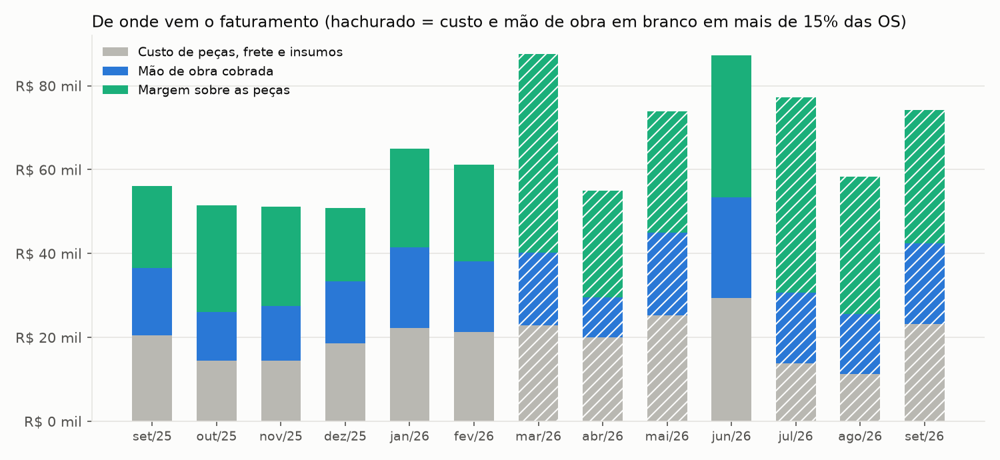
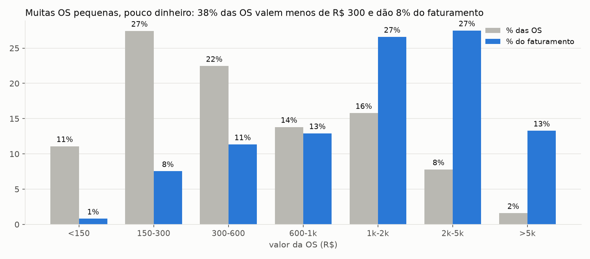
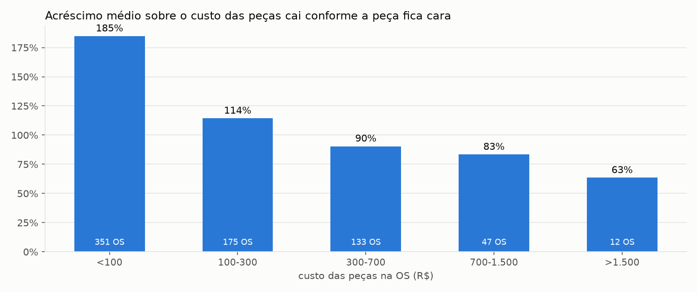
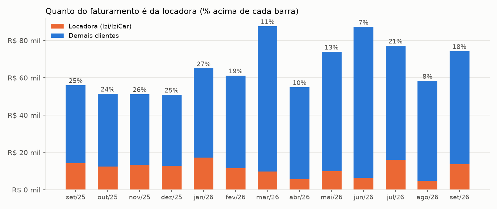
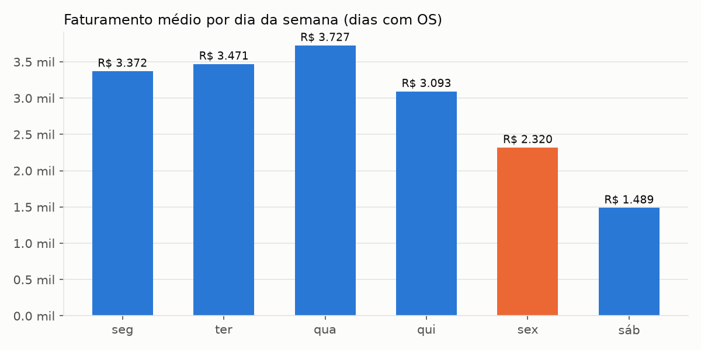

# 01. Diagnóstico da Multmec com os dados da planilha

> Base: planilha **CONTROLE SERVIÇOS**, aba SERVIÇOS, 1.064 ordens de serviço executadas entre **25/08/2025 e 02/10/2026**.
> Tudo aqui foi calculado por `analise/gerar_relatorio.py` (reproduzível) e os agregados estão em `docs/dados/metricas.json`.
> Este arquivo não traz nome de cliente nem placa de propósito.

## 0. Antes de ler: o que eu consegui e o que não consegui ver

| Material | Situação |
|---|---|
| Planilha CONTROLE SERVIÇOS (abas SERVIÇOS, MÃO DE OBRA, VALORES, PERMUTAS, CONTROLE SV AGCAR LOCADORA, Página9) | Lida inteira |
| Pasta ORDENS DE SERVIÇO (PDFs por mês) | Vi a estrutura e abri 2 PDFs para entender o formato; não li as ~1.100 |
| Link da pasta `1ZIZ41KfdB_...` | **Não abre com a minha conta do Google** ("não encontrado": provavelmente é privado da conta `multimecizi`) |
| Link da planilha `1ERhfPddkfj_...` | **Idem** |

Esses dois links que não abriram são, muito provavelmente, **o caixa** (entradas e saídas reais, folha, boletos, retiradas). Sem eles eu não sei o custo fixo da oficina. Tudo o que depende disso está marcado como **hipótese** e está explicado em `07-perguntas-e-pendencias.md`.
Não abri arquivos de caixa da IziCar Locadora que aparecem no mesmo Drive, porque você não me pediu isso.

## 1. Resumo em 10 linhas

1. A oficina faturou em média **R$ 65,3 mil por mês** nos 13 meses cheios (set/25 a set/26), com ~80 OS por mês e ticket médio de **R$ 822** (a mediana é só R$ 403).
2. Nos **últimos 6 meses** a média subiu para **R$ 71,0 mil** e o ticket para R$ 929. A tendência é de alta: média de set/25 a fev/26 = R$ 56,0 mil; de mar/26 a set/26 = R$ 73,4 mil (+31%).
3. O melhor mês foi **mar/26 (R$ 87,6 mil)**, seguido de jun/26 (R$ 87,3 mil). A meta de R$ 100 mil exige **+53% sobre a média de 13 meses**, **+41% sobre a média dos últimos 6** e **+14% sobre o melhor mês já feito**.
4. Quando o custo está preenchido (set/25 a fev/26), de cada R$ 100 faturados, **R$ 33 vão para peças, frete e insumos** e **R$ 67 sobram como lucro bruto** (R$ 27 de mão de obra + R$ 40 de margem sobre as peças). Esse é o número para planejar. Os meses recentes parecem mais gordos (80%+) só porque o custo deixou de ser preenchido.
5. **A mão de obra é só 25% do faturamento.** O negócio é, na prática, revenda de peça com serviço junto: 40% do lucro bruto vem da margem sobre as peças.
6. **38% das OS valem menos de R$ 300 e rendem 8% do faturamento.** As OS acima de R$ 2 mil (9% das OS) rendem 41%. Tempo de bancada gasto em OS pequena é o recurso mais caro da oficina.
7. O acréscimo sobre o custo da peça cai de **185%** (peças até R$ 100) para **63%** (peças acima de R$ 1.500). As OS grandes têm a margem percentual mais baixa.
8. A **locadora (Izi/IziCar) é 17% do faturamento** (277 OS, R$ 150 mil no período, ~R$ 11,4 mil/mês), com ticket 41% menor que o resto (R$ 543 contra R$ 917) e lucro bruto menor (60% contra 69%). Fora ela, **nenhum cliente passa de 4%**.
9. Pela planilha, desde jan/26 quase toda a produção é de **um mecânico** (Robson: 59 a 84 OS por mês); em set a dez/25 eram dois (Luiz e Robson). A receita subiu enquanto a planilha mostra menos gente produzindo: **o provável gargalo para R$ 100 mil é a bancada, não a falta de cliente** (confirmar a equipe real, ver perguntas).
10. **A planilha não responde "quem já pagou".** A marcação RECEBIDO parou em set/25. Desde jul/26 o lucro bruto não é calculado e desde ago/26 o mecânico não é informado. O controle financeiro que você quer precisa começar por aí.

## 2. Faturamento e lucro mês a mês

| Mês | OS | Faturamento | Ticket | Lucro bruto da planilha* | % |
|---|---:|---:|---:|---:|---:|
| set/25 | 76 | R$ 56.042 | R$ 737 | R$ 35.617 | 64% |
| out/25 | 78 | R$ 51.452 | R$ 660 | R$ 37.076 | 72% |
| nov/25 | 67 | R$ 51.240 | R$ 765 | R$ 36.783 | 72% |
| dez/25 | 89 | R$ 50.910 | R$ 572 | R$ 32.347 | 64% |
| jan/26 | 86 | R$ 65.005 | R$ 756 | R$ 42.800 | 66% |
| fev/26 | 82 | R$ 61.216 | R$ 747 | R$ 39.855 | 65% |
| mar/26 | 100 | R$ 87.611 | R$ 876 | R$ 64.675 † | 74% |
| abr/26 | 73 | R$ 54.932 | R$ 752 | R$ 34.912 † | 64% |
| mai/26 | 77 | R$ 73.919 | R$ 960 | R$ 48.644 † | 66% |
| jun/26 | 85 | R$ 87.273 | R$ 1.027 | R$ 57.875 | 66% |
| jul/26 | 88 | R$ 77.185 | R$ 877 | R$ 63.302 † | 82% |
| ago/26 | 63 | R$ 58.335 | R$ 926 | R$ 46.988 † | 81% |
| set/26 | 72 | R$ 74.259 | R$ 1.031 | R$ 51.121 † | 69% |
| **Média** | **80** | **R$ 65.337** | **R$ 822** | | |

\* Faturamento menos custo de peças, frete e insumos, recalculado por mim (a coluna LUCRO BRUTO da planilha está vazia desde jul/26 e ignora os insumos).
† Mais de 15% das OS do mês estão com **custo de peças e mão de obra em branco**: o lucro bruto desses meses está superestimado. Por isso uso **67%** (média de set/25 a fev/26, quando o preenchimento era bom) como margem de planejamento.

Observações:

- O mês varia de R$ 51 mil a R$ 88 mil sem padrão de calendário claro. Os meses fortes (mar e jun) têm várias OS acima de R$ 5 mil; no período inteiro, 17 OS desse tamanho somam R$ 116 mil.
- Out a dez/25 ficaram em R$ 51 mil. Se o fim de ano repetir, planeje o último trimestre como o mais fraco.
- "Faturamento" aqui é o **valor total das OS concluídas** (peça + mão de obra), a mesma coisa que a planilha chama de VL SERVIÇO. Orçamentos não entram (39 orçamentos, R$ 60,6 mil, ver seção 8).

## 3. Quanto sobra de cada R$ 100

Meses com custo bem preenchido (set/25 a fev/26), média mensal de R$ 56,0 mil:

| | R$/mês | % do faturamento |
|---|---:|---:|
| Custo das peças | 17.249 | 30,8% |
| Frete e insumos | 1.315 | 2,3% |
| **Lucro bruto** | **37.413** | **66,8%** |
| ... mão de obra cobrada | 15.265 | 27,3% |
| ... margem sobre as peças | 22.148 | 39,6% |

Em R$ 100 de faturamento: **R$ 33 de custo da mercadoria, R$ 27 de mão de obra e R$ 40 de ganho nas peças**. Referências de mercado (CINAU 2015: 35% mão de obra e 65% peças; Sebrae-SP/Sindirepa 2017: ticket ~R$ 800, margem líquida de 18% a 22%) mostram a Multmec **dentro do padrão** em ticket, e com uma participação de mão de obra um pouco menor, o que combina com a lista de preços de mão de obra baixa (seção 6).

O que a planilha **não** mostra: folha, aluguel, impostos, taxas de maquininha, boletos. Esse é o pedaço do caixa que falta.

## 4. Tamanho das OS: onde está o dinheiro

| Valor da OS | % das OS | % do faturamento |
|---|---:|---:|
| até R$ 150 | 11% | 1% |
| R$ 150 a 300 | 27% | 8% |
| R$ 300 a 600 | 22% | 11% |
| R$ 600 a 1.000 | 14% | 13% |
| R$ 1.000 a 2.000 | 16% | 27% |
| R$ 2.000 a 5.000 | 8% | 28% |
| acima de R$ 5.000 | 2% | 13% |

- **Os 5% maiores** somam 28% do faturamento; **os 10%**, 42%; **os 20%**, 60%.
- 410 OS abaixo de R$ 300 (38%) geraram R$ 73 mil em 13 meses, **R$ 5,6 mil por mês**. Cada uma ocupa uma vaga no elevador e um tempo de recepção.
- Cerca de 180 OS têm cara de **troca de óleo** (preço em torno de R$ 217 com peças de ~R$ 80). É uma porta de entrada boa (volta de 6 em 6 meses), mas não é onde se ganha dinheiro.
- Em ~8% das OS acima de R$ 300 (cerca de 7 por mês) há peça vendida e **nenhuma linha de mão de obra**, fora troca de óleo. Se for esquecimento e não preço fechado, são R$ 100 a R$ 150 por OS que não estão sendo cobrados.

## 5. Acréscimo sobre o custo das peças

| Custo das peças na OS | Nº de OS | Acréscimo médio sobre o custo |
|---|---:|---:|
| até R$ 100 | 351 | 185% |
| R$ 100 a 300 | 175 | 114% |
| R$ 300 a 700 | 133 | 90% |
| R$ 700 a 1.500 | 47 | 83% |
| acima de R$ 1.500 | 12 | 63% |

(set/25 a jun/26, só OS com custo informado.)

- A peça barata carrega o acréscimo grande (comum e esperado). **A peça cara fica com acréscimo pequeno**, justamente nas OS que mais pesam no faturamento.
- Simulação com um **piso**: se nenhuma OS ficasse abaixo de 60% de acréscimo, o ganho seria ~**R$ 1,2 mil por mês** (20% das OS ajustadas); com piso de 80%, **R$ 2,7 mil** (31% das OS); com piso de 100%, **R$ 4,9 mil** (41% das OS). É estimativa sobre o histórico, sem considerar perda de cliente por preço.

## 6. Clientes e a locadora

| | Locadora (Izi/IziCar) | Demais clientes |
|---|---:|---:|
| OS no período | 277 | 787 |
| Faturamento no período | R$ 150,5 mil (17,3%) | R$ 721 mil |
| Média mensal (13 meses cheios) | R$ 11,4 mil | |
| Ticket médio | R$ 543 | R$ 917 |
| Lucro bruto (meses confiáveis) | 60% | 69% |

- A tabela **MÃO DE OBRA** da planilha tem dois preços: "valor Izi" e "valor normal". Em 23 serviços comparáveis, o preço Izi é em média **28% menor** (mediana 25%, variando de 13% a 72%). A locadora paga menos pela mão de obra **e** paga com atraso.
- Peso no faturamento caiu de ~25% (set a dez/25) para 7% a 13% (mar a jun/26) e voltou a 21% e 18% (jul e set/26). A dependência existe e oscila.
- **Quanto o atraso custa em capital parado:** a locadora gera ~R$ 11,4 mil por mês. Cada **30 dias** de atraso médio mantém ~R$ 11,4 mil da oficina na mão da locadora. Com 60 dias são ~R$ 23 mil, quase a folha de um mês. (Cálculo: faturamento mensal × meses de atraso. O atraso real eu não consigo medir, porque a planilha não registra pagamento.)
- **Concentração nos outros clientes:** cerca de 280 nomes diferentes, o maior (fora a locadora) tem 3,9% e os 10 maiores somam 17,3%. É uma base pulverizada: sem a locadora, o risco de concentração é baixo.
- **Recompra:** os 324 carros (placas) diferentes aparecem em média **3,3 vezes** cada. 84% das OS são de carros que voltaram. Em 10% das OS o mesmo carro já tinha passado na oficina nos 7 dias anteriores e em 40% nos 30 dias anteriores. Parte é frota/locadora fazendo manutenção em etapas, parte pode ser retorno por problema. Vale auditar quanto é retrabalho (meta de mercado citada em blogs: abaixo de 3% das OS).
- A coluna **LOCADORA** da planilha tem "OK" em 302 OS (16% do faturamento), nem sempre para clientes IZI. Não sei o que o "OK" significa (ver perguntas).

## 7. Equipe e produtividade

Quantidade de OS por mecânico (coluna OPERADOR):

| | set/25 | dez/25 | fev/26 | abr/26 | jun/26 | jul/26 | ago/26 | set/26 |
|---|---:|---:|---:|---:|---:|---:|---:|---:|
| Robson | 37 | 34 | 59 | 63 | 84 | 78 | 2 | 0 |
| Luiz | 33 | 46 | 18 | 0 | 0 | 0 | 0 | 0 |
| Mateus, Gabriel, Douglas | 6 | 9 | 5 | 10 | 1 | 7 | 0 | 0 |
| Em branco | 0 | 0 | 0 | 0 | 0 | 3 | 61 | 72 |
| **Faturamento do mês** | 56 mil | 51 mil | 61 mil | 55 mil | 87 mil | 77 mil | 58 mil | 74 mil |

- Em set a dez/25 duas pessoas produziam ~R$ 50 mil por mês. Em mai a jul/26 **uma pessoa assinou R$ 74 mil a R$ 87 mil**, ~80 OS/mês, mais de 3,5 OS por dia útil. Ou a equipe de bancada é maior do que a planilha mostra, ou o Robson está perto do limite.
- Conta de referência (regra de blog, não é fonte primária): um mecânico tem ~120 horas vendáveis por mês (160 h x 75%). A mão de obra cobrada nos últimos 6 meses (R$ 17,2 mil/mês) dá ~R$ 144 por hora vendável. Para R$ 100 mil mantendo 25% de mão de obra seriam R$ 25 mil, ou ~R$ 208/h, no teto das faixas de hora técnica citadas por blogs (R$ 80 a R$ 210). **Se a produção continua em uma pessoa, R$ 100 mil só fecha com mais dinheiro por hora de bancada** (OS maiores, preço, peça): ver `02-plano-100k.md`.
- A partir de ago/26 o campo operador deixou de ser preenchido. Sem isso não dá para medir produtividade nem comissão.

## 8. Dias da semana e orçamentos

- De segunda a quinta a oficina fatura em média R$ 3,1 mil a R$ 3,7 mil por dia. **A sexta rende R$ 2,3 mil (32% menos)** e o sábado R$ 1,5 mil, em apenas 13 sábados com movimento em 13 meses.
- Média: **R$ 3,0 mil por dia útil**. A meta de R$ 100 mil exige ~**R$ 4,5 mil por dia útil**.
- **39 orçamentos** registrados (R$ 60,6 mil), sendo 9 em jul, 4 em set. A planilha não diz quais viraram OS, então a taxa de aprovação é desconhecida. Referência de blog (sem fonte primária): 55% a 75% é bom, abaixo de 40% é problema.

## 9. Problemas de qualidade da planilha (e por que importam)

| Problema | Impacto |
|---|---|
| Marcação **RECEBIDO** parou em set/25 (só 33 OS marcadas) | Não existe contas a receber. Não dá para saber quanto a locadora, nem ninguém, deve. |
| Coluna **LUCRO BRUTO** vazia desde jul/26 (e ignora insumos) | A margem real dos últimos 3 meses é invisível. |
| **Custo de peças em branco**: 3% das OS em set/25 a fev/26, 17% a 21% em mar a mai/26, 28% a 40% em jul a set/26 | Margem superestimada; pode esconder OS com prejuízo. |
| **OPERADOR em branco** a partir de ago/26 (97% a 100%) | Sem produtividade por mecânico. |
| **Datas**: 94 linhas com data digitada errada ou sem ano (ex.: "19/12" no meio de novembro, "27/08/2028") | Faturamento "joga" de um mês para o outro. Corrigi pela posição na planilha. |
| Subtotais mensais da própria planilha (linhas FEVEREIRO e MARÇO) **não batem** com o mês que dizem (parecem trocados de mês) | Os números que você vê no rodapé podem enganar. |
| Orçamentos misturados com OS na mesma coluna | Fácil contar orçamento como venda. |
| Clientes grafados de várias formas (IZI, IZICAR, IZICR) | Soma por cliente errada. |
| Compra de peças lançada como OS (OS 194, −R$ 2.407) | Distorce o mês. |

Conclusão: o problema não é preguiça de quem preenche. É uma planilha com 17 colunas, preenchida à mão **depois** do serviço, em cima de um sistema de OS que já tem esses dados. O sistema novo precisa pedir só o que o ERP não tem (custo das peças e recebimento) e **bloquear** o fechamento da OS sem eles.

## 10. O que os dados não dizem

- Custos fixos, folha, retiradas, impostos e boletos (precisa do caixa).
- Quem pagou e quando (inclusive a locadora).
- Quantos mecânicos/ajudantes realmente existem e o que cada um custa.
- Horas gastas em cada serviço (para saber R$ por hora de bancada).
- Quantos orçamentos viraram serviço.
- Se existem OS que não foram para a planilha.
