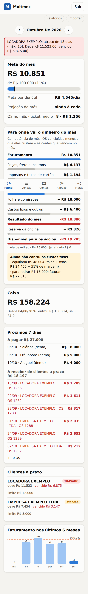
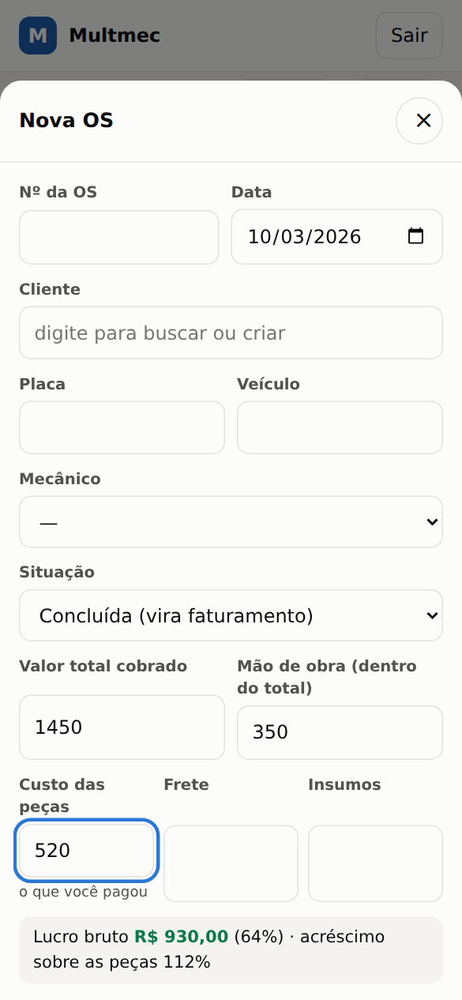
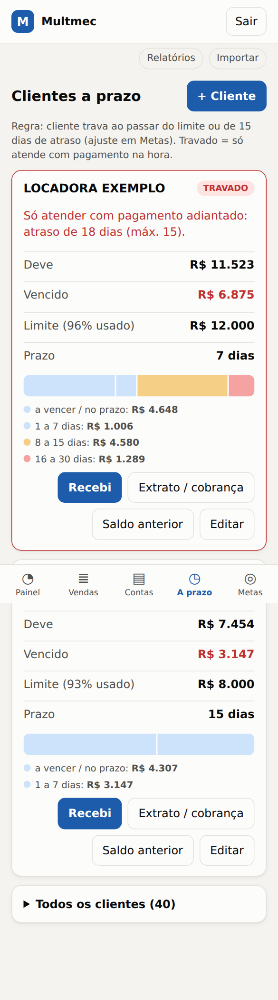

# 05. Especificação do sistema (Multmec Financeiro)

> O protótipo funcional está em `app/` e já roda com dados reais importados da planilha. Este documento descreve o que ele faz, por que foi desenhado assim, o que ainda falta e como crescer.

## 1. Princípios

1. **Menos é mais.** Três perguntas por dia (`03-controle-financeiro.md`), duas telas de digitação (OS e conta), o resto é cálculo.
2. **Não competir com o sistema de OS e notas** que a oficina já usa. Aquele continua sendo a fonte da OS, da nota, do estoque. O financeiro guarda só o que lá não existe: custo das peças, recebimento, contas a pagar, metas e crédito de cliente.
3. **Obrigar o dado que importa.** Hoje a margem some porque o custo da peça fica em branco. O sistema destaca toda OS sem custo e a cascata do mês a estima para não esconder o problema.
4. **Celular primeiro.** A oficina é um lugar de mãos sujas. As telas funcionam no celular, com botões grandes e um botão "+" para lançar a OS.
5. **Dado da oficina fica da oficina.** Banco em arquivo (SQLite) sob controle de vocês; nada de dado real no repositório.

## 2. Telas e situação

| Tela | O que faz | Situação |
|---|---|---|
| **Painel** | Meta do mês com projeção e "quanto por dia útil"; cascata do mês; caixa; próximos 7 dias (a pagar e a receber); clientes a prazo; alertas; gráfico de 6 meses | **Pronto** |
| **Vendas** | Lista e busca (placa, OS, cliente); filtros "em aberto", "sem custo", "orçamentos"; lançar/editar OS com lucro bruto e acréscimo ao vivo; "recebi hoje"; aprovar orçamento | **Pronto** |
| **Contas** | A pagar por mês (atrasadas / a pagar / pagas); marcar pago; **modelos fixos** que geram as contas todo mês | **Pronto** |
| **A prazo** | Locadora e frotas: prazo, limite, faixas de atraso, **trava**, saldo anterior, recebimento (quita o mais antigo), extrato, texto de cobrança | **Pronto** |
| **Metas** | Meta, retirada dos sócios, % de imposto/maquininha/reserva, feriados, saldo do banco, dias de trava; **simulador** (OS x ticket) | **Pronto** |
| **Compras** | Conferência de compras: importa o XML das notas, cadastra o boleto pela linha digitável, liga **nota × boleto × peça × OS**, lista as ocorrências de auditoria (boleto sem nota, beneficiário diferente, valor a mais, duplicidade...) e **trava o pagamento** de boleto com problema grave. Detalhes em [`09-conciliacao-compras.md`](09-conciliacao-compras.md) | **Pronto**. Abas: Conferência, Boletos, Notas (XML ou DANFE), Fornecedores, Grupo (empresas e acerto entre elas) e DDA (importação do banco); dois perfis de acesso (dono e quem só lança) |
| **Relatórios** | Mês a mês, faixas de ticket, acréscimo por faixa de custo, clientes, mecânicos, orçamentos parados; exporta CSV | **Pronto** |
| **Importar** | Carrega a planilha CONTROLE SERVIÇOS (CSV), com prévia e data de corte | **Pronto** |
| Usuários e permissões | Um login por pessoa (sócio, atendente, mecânico), com o que cada um vê | Fase 2 |
| Projeção de caixa (4 e 13 semanas) | Entradas e saídas previstas semana a semana | Fase 2 |
| Conciliação bancária | Importar extrato (OFX/CSV) e casar com recebimentos e saídas | Fase 2 |
| Horas por OS (tempário) | R$ por hora de bancada e ocupação por mecânico | Fase 2 |
| Custo por placa | Relatório da locadora por carro | Fase 2 |
| Leitura do PDF da OS | Preencher valor, mão de obra e frete a partir do PDF do sistema de OS | Fase 2 |
| Avisos por WhatsApp | Cobrança, lembrete de revisão, follow-up de orçamento | Fase 3 |

### Como é por dentro (telas de demonstração, dados inventados)

| Painel | Nova OS | Clientes a prazo |
|---|---|---|
|  |  |  |

Perfis e empresas do grupo: [Quem só lança](img/perfil_00_lancamento.png) · [Acerto entre empresas](img/grupo_01_entre_empresas.png) · [Boleto da locadora](img/grupo_06_boleto_da_locadora.png) · [Nota sem XML](img/grupo_04_nota_sem_xml.png) · [Ler a DANFE](img/grupo_05_ler_danfe.png) · [DDA do banco](img/grupo_02_dda.png).

Conferência de compras: [Conferência](img/compras_01_conferencia.png) · [Boletos](img/compras_02_boletos.png) · [Detalhe de um boleto](img/compras_03_boleto_detalhe.png) · [Novo boleto colando o texto](img/compras_04_novo_boleto.png) · [Informar quem recebe](img/compras_08_informar_quem_recebe.png) · [Antes de pagar](img/compras_09_antes_de_pagar.png) · [Pagamento travado](img/compras_07_pagamento_travado.png).

Outras telas: [Vendas](img/app_02_vendas.png) · [Contas](img/app_05_contas.png) · [Metas e simulador](img/app_06_metas.png). Nessas imagens a locadora aparece **TRAVADA** porque o banco de demonstração tem 18 dias de atraso inventados.

## 3. Modelo de dados

```
clientes(id, nome, tipo[avulso|frota|locadora|revenda], prazo_dias, limite_credito, ativo, obs)
mecanicos(id, nome, ativo)
vendas(id, numero, data, cliente_id, veiculo, placa, mecanico_id,
       situacao[orcamento|aberta|concluida|cancelada|saldo],
       valor_total, valor_mao_obra, custo_pecas*, custo_frete, custo_insumos,
       forma_pagamento, vencimento, data_estimada, origem, chave_import, obs)
recebimentos(id, venda_id, data, valor, forma, obs)       -- uma venda pode ter vários
categorias(id, nome, grupo[pecas|imposto|folha|fixo|socios|reserva|outros])
recorrentes(id, descricao, categoria_id, valor, dia_vencimento, ativo)
saidas(id, descricao, categoria_id, fornecedor, valor, vencimento, pago_em, valor_pago,
       recorrente_id, competencia)                         -- única por (recorrente, mês)
config(chave, valor)
```

\* `custo_pecas` NULL = "ainda não informado". É diferente de zero e dispara alerta.

Decisões:

- **Saldo anterior** de um cliente é uma "venda" com situação `saldo`. Assim aging, recebimento FIFO e extrato funcionam sem tratamento especial, e ela **não conta como faturamento**.
- **Competência x caixa.** O faturamento e a cascata usam a **data da OS**; o caixa usa a **data do recebimento e do pagamento**. As duas visões nunca se misturam.
- Valores em reais com 2 casas, arredondados na entrada e na saída (suficiente para o volume; migrar para centavos inteiros se algum dia houver milhares de lançamentos por dia).
- Recebimentos "histórico" (criados na importação por corte) **não entram no caixa**.

## 4. Regras de negócio e onde estão

| Regra | Código |
|---|---|
| Faturamento = OS `concluida`; orçamento, cancelada e saldo não contam | `finance.js: resumoMes` |
| Lucro bruto = total − custo das peças − frete − insumos. Margem das peças = lucro bruto − mão de obra | `resumoMes` |
| OS sem custo de peças (e com mais de R$ 50 além da mão de obra) é sinalizada; a cascata estima o custo pelo CMV dos últimos meses confiáveis | `resumoMes`, `cmvMedido`, `cascata` |
| Cascata: faturamento → custos → impostos/taxas → folha → fixos → resultado → reserva → disponível para os sócios | `cascata` |
| Ponto de equilíbrio = (folha + fixos + outros) ÷ margem de contribuição | `pontoEquilibrio` |
| Termômetro: ritmo por dia útil, projeção, quanto por dia que falta, OS e ticket necessários | `termometro` |
| Cliente a prazo trava ao passar do limite ou de N dias de atraso (padrão 15) | `situacaoCliente` |
| Recebimento do cliente quita primeiro o saldo anterior e depois as OS mais antigas | `receberDoCliente` |
| Contas fixas geradas uma vez por mês, apenas para o mês atual e o próximo | `gerarRecorrentes`, `api.js` |
| Cliente avulso com OS sem recebimento gera **um** alerta agregado (não "trava" cliente avulso) | `alertas` |

## 5. Importação da planilha

`app/src/importar.js` aplica, em uma passada, o que a análise precisou fazer à mão:

- Ignora linhas de mês e subtotais, OS sem valor e compra de peça lançada como OS.
- Interpreta `R$ 1.234,56`, `-R$ 28,00`, vazios.
- **Datas:** aceita `dd/mm/aaaa`, corrige digitações conhecidas (`27/08/2028`, `21/001/2026`, `19/022026`), completa `dd/mm` sem ano e usa a mediana das vizinhas para recolocar datas absurdas (`19/12` no meio de novembro). Linhas assim ficam com `data_estimada = 1`. Conferi manualmente que os totais por mês saem iguais aos da análise em Python (`analise/`).
- Orçamentos viram `situacao = orcamento`.
- IZI, IZICAR e IZICR viram o cliente `IZICAR` (tipo locadora, prazo 7 dias).
- **Data de corte:** tudo até a data escolhida entra como já recebido ("histórico"). Evita criar R$ 800 mil de contas a receber falsas. Depois, o saldo real de cada cliente a prazo entra em **Saldo anterior**.
- Reimportar não duplica (chave `número|placa|data`).

## 6. Integração com o sistema de OS

O sistema de OS atual (versão "3.4.265.2775", relatório R65 "Rel Ordem Serviço Veículo") imprime um PDF com: código da OS, data, cliente, placa, modelo, **itens** (peças com valor, uma linha `FRETE`, linhas `MAO DE OBRA ...`), total de produtos, total de serviços, desconto e valor total. **Não imprime custo das peças**, por isso o custo continua sendo digitado.

Caminhos para sair da digitação dupla, do mais simples ao mais completo:

1. **Hoje:** lançar a OS no financeiro com 4 números (total, mão de obra, custo das peças, frete). 1 minuto por OS.
2. **Fase 2, leitura do PDF:** o PDF tem estrutura previsível; um leitor preenche total, mão de obra e frete e deixa só o custo para digitar. Os PDFs já são salvos em pastas mensais no Drive.
3. **Fase 3, direto do banco ou API do sistema de OS:** exige perguntar ao fornecedor se existe API/exportação. Eu não sei o nome do fornecedor nem se há. Está em `07-perguntas-e-pendencias.md`.

## 7. Segurança e LGPD

O sistema guarda **nome, placa e valor de clientes**: são dados pessoais.

| Medida | No protótipo |
|---|---|
| Senha de acesso exigida (mín. 10 caracteres em produção) | Sim. O servidor se recusa a subir em produção sem senha |
| Cookie `HttpOnly`, `SameSite=Lax`, `Secure` atrás de HTTPS, validade de 14 dias, assinado (HMAC) | Sim |
| Limite de tentativas de senha (5 em 10 minutos por IP) | Sim |
| API só aceita JSON (formulário de outro site não consegue gravar) | Sim |
| Cabeçalhos de segurança (CSP restritiva, `nosniff`, sem iframe) | Sim |
| Consultas SQL parametrizadas; saída da tela sempre como texto (sem `innerHTML` com dado) | Sim |
| CSV exportado neutraliza fórmula (`=`, `+`, `-`, `@`) | Sim |
| Dado real fora do Git (`.gitignore` bloqueia `data/`, `*.db`, `.env`, `analise/dados/`) | Sim |
| Login individual, trilha de auditoria (quem mudou o quê) | **Fase 2** |
| Backup automático do banco | **Responsabilidade da hospedagem**: `08-hospedagem.md` |
| Política de privacidade e base legal (execução de contrato / legítimo interesse) | Conversar com o contador/advogado |

## 8. Decisões técnicas

- **Node.js + Express + SQLite (`better-sqlite3`).** Uma pasta, um processo, um arquivo de banco. Cabe numa hospedagem pequena. Tecnologia comum, fácil de manter.
- **Front-end sem framework e sem build.** Arquivos estáticos servidos pelo próprio Express. Menos coisa para quebrar e para hospedar. Gráficos em SVG próprios.
- **Testes** com o executor nativo do Node: `cd app && npm test`. 127 testes cobrindo importação, datas, cascata, termômetro, aging, recebimento FIFO, caixa, autenticação, o fluxo de OS pela API e a conferência de compras (chave da NF-e, CNPJ, linha digitável e fator de vencimento com vetores independentes, leitura do XML, conciliação, ocorrências e trava de pagamento).
- **Se a hospedagem for só PHP/MySQL** (comum em plano compartilhado), este sistema não roda lá. Teria de ser reescrito ou hospedado em outro lugar (`08-hospedagem.md`, seção "E se a hospedagem for compartilhada"). É uma das perguntas em `07`.

## 9. Limitações conhecidas do protótipo

- Uma senha para todos (sem perfis).
- Sem histórico de alterações.
- Sem backup automático (só o que a hospedagem fizer).
- Feriados nacionais não vêm pré-carregados: informe em Metas.
- Lista de vendas limitada a 400 linhas por busca (use mês e filtros).
- Contas fixas de meses passados não são geradas; o resultado de um mês passado só desconta as contas que foram lançadas nele.
- O caixa depende de você informar o saldo do banco de um dia (Metas). Antes disso, o painel pede para informar.
- A hora de bancada não é medida (fase 2).
- Layout conferido em celular e desktop com navegador de teste; não testei em todos os aparelhos.

## 10. Itens do CDC a refletir no sistema de OS

Não são do financeiro, mas valem checar no sistema que emite a OS (fonte e artigos em `06-pesquisa.md`): orçamento prévio por escrito com mão de obra, materiais, condições de pagamento e prazo, **válido por 10 dias** (art. 40); peças novas e originais, e peça usada só com autorização expressa (art. 21 e 70); garantia legal de **90 dias** (art. 26); termo de garantia por escrito (art. 50).
