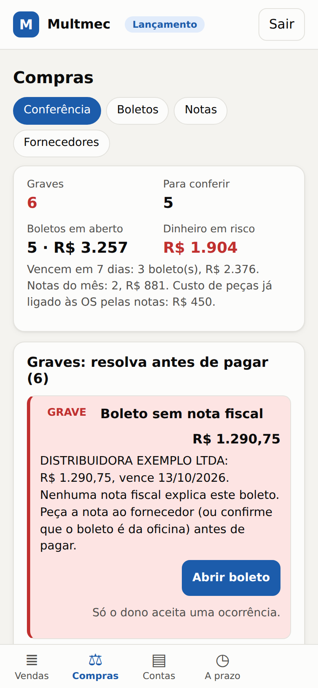
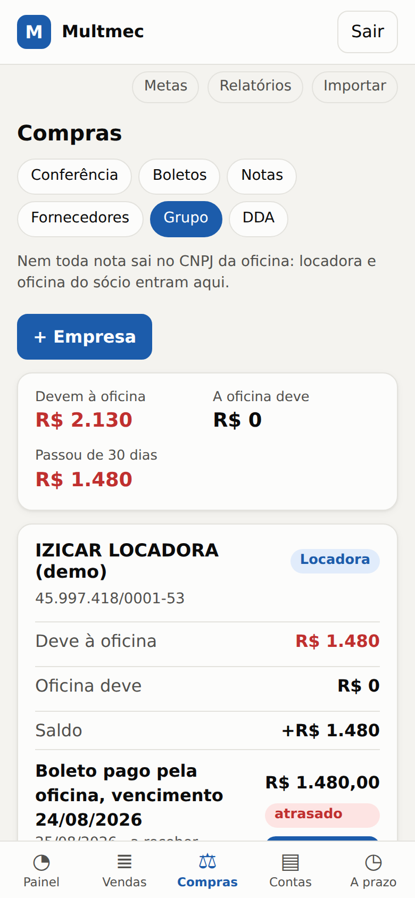
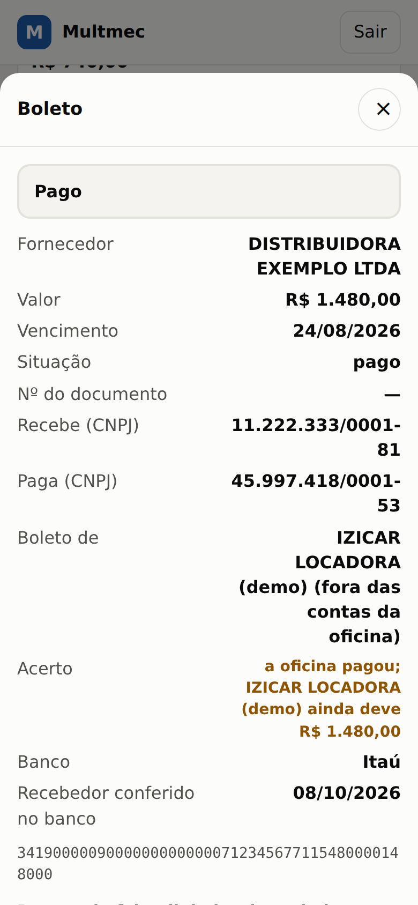
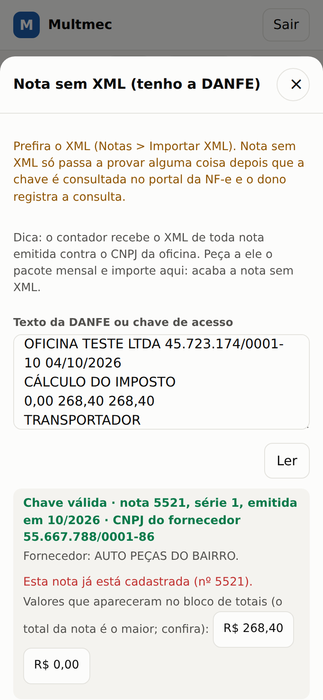
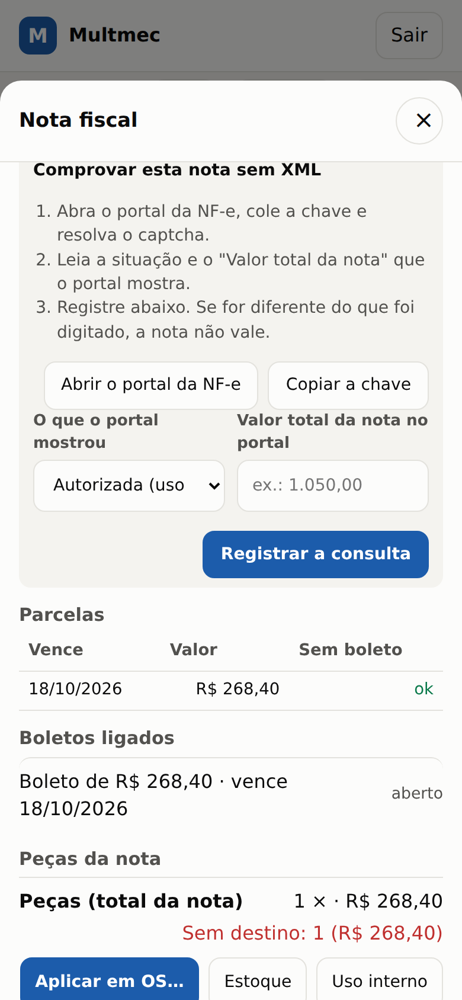
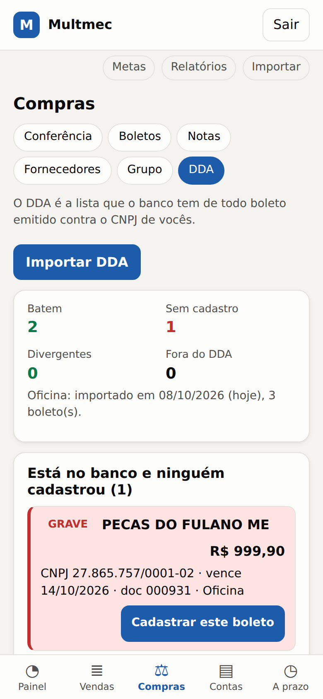

# 09. Conferência de compras: nota fiscal × boleto × OS

> Problema que você descreveu: o fornecedor emite **nota fiscal** e **boleto**, mas o boleto traz só o valor. Hoje, se a Scherer (ou qualquer outro) mandar um boleto que não é da oficina, **ninguém percebe**. Este módulo fecha essa lacuna: cada real pago a fornecedor precisa ter uma **nota** por trás e cada peça da nota precisa ter um **destino** (uma OS, o estoque ou o uso interno).
> Fica na aba **Compras** do sistema. Os dados das telas abaixo são inventados.
>
> **Atualização (2ª rodada):** o sistema agora separa **quem lança e quem paga** (seção 10), trata nota e boleto que saem **no CNPJ da locadora ou da oficina do sócio** (seção 11), aceita **nota sem XML** com consulta no portal (seção 12) e **importa o DDA do banco** (seção 13).

## 1. A corrente que o sistema fecha

```
Fornecedor ──▶ Nota fiscal (XML) ──▶ Boleto ──▶ Pagamento (Contas)
                    │
                    └──▶ Peça (item da nota) ──▶ OS nº tal
```

Para cada ligação o sistema confere uma coisa que a oficina hoje não confere:

| Ligação | O que o sistema confere |
|---|---|
| Nota ↔ fornecedor | A nota existe de verdade (chave de acesso de 44 dígitos com dígito verificador certo), foi emitida **para o CNPJ da oficina**, não está cancelada. |
| Boleto ↔ nota | O valor e o vencimento batem com uma parcela da nota (ou com a soma de algumas notas). O beneficiário do boleto é o fornecedor da nota. O pagador é a oficina. |
| Boleto ↔ boleto | O mesmo boleto não entra duas vezes, nem dois boletos iguais para a mesma compra. |
| Nota ↔ peça ↔ OS | Cada item da nota vai para uma OS, para o estoque ou para uso interno, sem passar da quantidade comprada. O custo da peça na OS vem da nota. |
| Pagamento | O recebedor foi **conferido no app do banco** (ou pelo DDA importado) e **boleto com problema grave não é pago sem uma justificativa registrada**. Só o **dono** paga. |
| Banco ↔ cadastro | O **DDA** que o dono importa do banco mostra todo boleto contra o CNPJ: o que o banco mostra e ninguém cadastrou, ou foi cadastrado diferente, vira alerta grave. |

## 2. Como usar no dia a dia (10 minutos por dia)

1. **Chegou nota** (e-mail, WhatsApp, portal do fornecedor): em **Compras > Notas > Importar XML** (ou **+ Nota** para digitar sem XML), escolha o(s) arquivo(s). O sistema lê fornecedor, itens, parcelas e guarda o XML original. Vários arquivos de uma vez funcionam.
2. **Chegou boleto**: em **Compras > Boletos > + Boleto**, cole a **linha digitável** (ou o código de barras). O sistema lê banco, valor e vencimento sozinho e, ao apertar **Cadastrar e conferir**, já tenta ligar à nota certa. Se o boleto veio com vários na mesma folha, use **Colar vários** (até 60 linhas; depois abra cada um para informar quem recebe).
   - **Atalho:** em vez da linha, você pode colar o **texto inteiro do boleto** (abra o PDF, selecione tudo, copie). O sistema acha a linha digitável sozinho e tenta separar o **CNPJ de quem recebe**, o **CNPJ de quem paga** e o **número do documento** pelos rótulos do boleto. O que ele não tiver certeza, deixa em branco. **Confira os campos preenchidos com o boleto na mão**: o texto de um boleto adulterado também vem "certinho".
   - O **CNPJ de quem recebe** é o campo que pega o boleto "de outra pessoa". Ele **não vem no código de barras**: ou vem do texto/PDF, ou uma pessoa digita olhando o boleto. Se faltar, dá para informar depois, no próprio boleto (**Informar quem recebe / paga**).
3. **Olhe o veredito.** Cada boleto mostra uma faixa: **NÃO PAGUE** (há problema grave), **NÃO CONFERIDO** (falta o CNPJ de quem recebe ou de quem paga) ou **Conferido com a nota**. Na lista de Boletos e na tela de **Contas** aparece o mesmo selo, antes de você tocar em *Paguei*.
4. **Peças**: em cada nota, **Aplicar em OS**. Se o fornecedor colocou o número da OS no pedido (`xPed`, por exemplo `OS1043`) ou a placa no texto da nota, o sistema já **sugere** a OS; basta confirmar. Na tela da OS, **Ligar peça de uma nota…** faz o caminho inverso.
5. **Pagar (só o dono)**: em **Contas**, *Paguei* num boleto abre **Antes de pagar**. O sistema pede que você **cole a linha digitável no app do banco e confira o nome e o CNPJ de quem recebe** (é a única prova de que o dinheiro vai para o fornecedor) e marque a caixa. Se o boleto está no **DDA importado** e bate (valor, vencimento e CNPJ de quem recebe), essa conferência já foi feita pelo banco e o sistema não pede de novo. Se houver problema grave, aparece **Pagamento travado** e é preciso escrever o motivo.
6. **Olhe a aba Conferência** uma vez por dia (ou semana): é a lista de tudo que precisa de atenção, da mais grave para a menos.

Ao abrir o sistema pela primeira vez, vá em **Metas** e preencha o **CNPJ da oficina**; depois, em **Compras > Fornecedores**, confira o CNPJ e o telefone de cada fornecedor (pelo cartão CNPJ e por um telefone que a oficina já tinha) e marque *conferi* (só o dono marca). **O primeiro pagamento a um fornecedor que ninguém conferiu fica travado** até o dono conferir ou justificar.

## 3. O que cada ocorrência significa e o que fazer

**Alta** (pare antes de pagar):

| Ocorrência | Significa | O que fazer |
|---|---|---|
| Boleto sem nota fiscal | Nenhuma nota explica esse boleto. | Peça a nota ao fornecedor. Sem nota, não pague. |
| Boleto ligado a nota sem comprovação | A nota foi digitada à mão ou o XML não traz protocolo de autorização: não prova nada. | Importe o XML autorizado ou consulte a chave no portal da NF-e e registre ao liberar. |
| Beneficiário do boleto NÃO é o fornecedor | O CNPJ que recebe o dinheiro é outro. Mesma raiz de CNPJ (outra filial) vira aviso médio. Não vale se o CNPJ está em *Outros CNPJs que podem receber* do fornecedor ou na própria nota. | Ligue para o fornecedor num telefone **que você já tinha**, não o do boleto. Golpe de boleto adulterado costuma ser assim. |
| Boleto emitido contra outro CNPJ | O pagador impresso não é a oficina. | Pode ser boleto de outro cliente enviado por engano (ou de propósito). Não pague. |
| Boleto ligado a nota de outro fornecedor | Boleto e nota são de empresas diferentes. | Desfaça a ligação e ache a nota certa. |
| Nota emitida para outro CNPJ | A nota é de outro destinatário. | Pode ser nota de outro cliente. Peça a correta. |
| Boleto cobra mais do que as notas explicam | Sobra dinheiro: juros, nota faltando, ou cobrança indevida. | Peça o detalhamento. |
| Boletos somam mais que a nota | Mais boleto do que nota: possível cobrança em duplicidade. | Pague só o que a nota cobre. |
| Boleto de nota CANCELADA ou DENEGADA | O fornecedor cancelou a nota (ou a SEFAZ negou o uso dela) e ainda cobra. | Não pague; peça que o fornecedor cancele o título. |
| Possível boleto em duplicidade / Segunda via do mesmo título | Mesmo fornecedor, valor e vencimento; ou o mesmo número de título (nosso número) com outro vencimento. | Pague um só, depois de confirmar. |

**Média** (resolver na semana): boleto vencido; **banco diferente do que o fornecedor costuma usar** (depois de 2 boletos do mesmo fornecedor, um boleto de outro banco é o sinal mais comum de boleto adulterado, mas também acontece troca legítima de conta: confirme por telefone); **fornecedor ainda não conferido**; **documento impresso no boleto que não é o da nota**; boleto cadastrado **sem linha digitável**; parcela perto de vencer ou vencida **sem boleto**; **contas de peças lançadas direto em Contas sem boleto em Compras**; custo da OS diferente das notas; peças de uma nota sem destino (depois de alguns dias); CNPJ da oficina não informado; fornecedor sem CNPJ; valor ligado às notas maior que o boleto.

**Baixa** (organização): **falta conferir quem recebe ou quem paga** (sobe para média quando faltam 3 dias ou menos para vencer: é a hora de olhar o app do banco); nota digitada sem chave de acesso; preço de peça bem acima do histórico; vencimento do boleto diferente da parcela; OS com custo de peça e nenhuma nota (resumo único).

### "Está certo, conferi" (aceite)

Algumas ocorrências são normais (nota paga à vista no Pix, preço subiu mesmo, boleto de filial). Aperte **Conferi, está certo** e escreva o motivo (**mínimo 10 letras**, não vale "aaaaaaaaaa"). Regras:
- só dá para aceitar uma ocorrência que **existe agora**;
- o aceite **vale só para aquele fato**: se a divergência aceita era de R$ 30 e depois vira R$ 310, ou o grupo de boletos muda, a ocorrência volta e o sistema avisa que a versão aceita é outra;
- fica no **histórico** (só inclusão: nada é apagado), e se o boleto for pago com ocorrência grave aceita, o motivo é gravado no próprio boleto.

### Pagamento: o que o sistema exige

1. **Conferir o recebedor no app do banco** (caixa de marcar), uma vez por boleto.
2. Se há ocorrência **alta** não aceita: **Pagar mesmo assim** com motivo escrito (mínimo 10 letras). Isso não impede o dono de pagar; impede de pagar **sem ver**.
3. Se o **valor pago** for diferente do valor do boleto (juros, multa, desconto), é preciso explicar o motivo.
4. Boleto **contestado** não paga (reabra antes). Quem **cancela ou contesta** um boleto libera a nota: ela volta a precisar de boleto e o boleto certo liga sozinho.
5. Uma conta já lançada em Contas com o mesmo valor e vencimento é **adotada** pelo boleto (não duplica a dívida). Valor, vencimento e categoria de uma conta de boleto não se editam em Contas.

### Histórico (trilha de auditoria)

Cada boleto mostra o **Histórico**: ligações, correções, pagamento, liberação, cancelamento. Há também registro de notas apagadas e de mudanças em fornecedores. O sistema ainda usa **uma senha só**: o histórico diz **o que** e **quando**, não **quem**. Se a oficina precisar de responsabilidade por pessoa (quem cadastra não é quem paga), o próximo passo é login individual.

## 4. Como o sistema liga boleto a nota

O boleto não diz a qual nota pertence, então o sistema pontua os candidatos do mesmo fornecedor:

| Pontos | Quando |
|---:|---|
| 100 | Valor e vencimento batem com uma parcela da nota |
| 95 | O número do documento impresso no boleto é o da nota e o valor bate (outro vencimento, ou nota sem parcelas) |
| 90 / 70 | O boleto cobre o saldo de **todas** as parcelas juntas (90 se o número do documento também bate, 70 se não) |
| 85 | Valor igual a uma parcela, vencimento diferente |
| 80 | Nota sem parcelas e saldo igual ao boleto |
| 75 | O número bate mas o valor do boleto é outro (vira alerta de divergência) |
| 60 | Soma de 2 a 5 notas do fornecedor bate com o boleto (boleto agrupado) |

A ligação é feita **automaticamente só se a melhor opção tiver 90 pontos ou mais e estiver pelo menos 10 pontos acima da segunda**. Nos outros casos aparece como **sugestão** para você escolher. Você pode ligar à mão (**Ligar a outra nota…**) e desfazer.

## 5. O que o sistema NÃO consegue saber (limites honestos)

1. **Dígitos verificadores pegam erro de digitação, não fraude.** Um golpista gera um boleto com dígitos corretos. A defesa contra fraude é **comparar o CNPJ do beneficiário** com o do fornecedor e **ter a nota por trás**, não a validade do código. O sistema só recusa o que é matematicamente impossível (dígito errado, vencimento fora da faixa que os bancos aceitam).
2. **O CNPJ do beneficiário e o do pagador não estão no código de barras.** Vêm do texto/PDF do boleto, do app do banco ou do DDA. Se o campo ficar vazio, a regra **não dispara**.
3. **O XML sozinho não prova a nota.** Um arquivo `.xml` pode ser forjado ou alterado depois de autorizado; o sistema confere que a chave, o número, o CNPJ e o protocolo são coerentes entre si e guarda o arquivo, mas **não verifica a assinatura digital nem consulta a SEFAZ**. A prova real é consultar a chave no portal nacional da NF-e (grátis, com captcha) ou, na fase 2, pelo certificado da oficina. Faça isso nas notas grandes e em qualquer nota que o sistema marque como estranha.
4. **Nota digitada à mão não prova nada.** Pode ter sido inventada ou errada. O sistema marca como "sem chave" e não a trata como confirmação forte.
5. **Só vê o que foi lançado.** Se um boleto não for cadastrado, o sistema não sabe que ele existe. A rotina precisa ser: **todo boleto que chega é cadastrado antes de ir para pagamento**. O DDA do banco (seção 7) é o que fecha essa brecha.
6. **O XML não diz qual é o boleto.** O XML da nota traz o valor e as parcelas (quando o fornecedor preenche), mas nenhum campo identifica o boleto. A ligação é por fornecedor + valor + vencimento (e pelo "número do documento" do boleto, quando existe). Se o fornecedor **agrupa várias notas num boleto** (fatura do período), o sistema tenta achar a combinação de 2 a 5 notas; se não achar, pede ligação manual.
7. **Parcelas são opcionais na nota.** Muita nota sai sem as parcelas; nesse caso o sistema compara o boleto com o saldo da nota inteira. Em nota de fornecedor do Regime Normal (reforma tributária, 2026) o total pode vir com **IBS/CBS "por fora"**; o sistema aceita o boleto por qualquer um dos dois valores e avisa que há dois.
8. **Boleto vencido** costuma ter juros e multa que não aparecem no código de barras: a diferença na hora de pagar é encargo, não erro.
9. **Preço acima do histórico** compara com as suas compras anteriores no sistema; com pouca história, não alerta.
10. **A OS informada pelo fornecedor** (`xPed`, até 15 caracteres, ex.: `OS1043`) só aparece se o fornecedor preencher. Se ele não preenche, você aplica à mão (rápido, mas é trabalho).
11. **Nota de devolução, crédito ou ajuste** não gera boleto: o sistema as separa (um boleto ligado a elas é suspeito) mas **ainda não abate** o crédito do que você deve.
12. **Ainda não sabemos como a Scherer preenche as notas** (parcelas, pedido, texto livre). Veja os 10 a 20 primeiros XML dela e ajuste as regras com base neles.

## 6. Rotina que fecha o controle (processo, não só sistema)

Sugestões para combinar com os fornecedores, principalmente a Scherer:

- Pedir que o **número da OS (ou a placa)** vá no **pedido de compra** da nota (campo `xPed`) ou nas informações complementares. Quem emite por sistema consegue.
- Pedir que o **número da nota** apareça no campo **número do documento** do boleto (padrão na maioria dos bancos).
- Combinar **um único e-mail** da oficina para receber XML e boleto, e **um responsável** que cadastra no mesmo dia.
- Nunca pagar boleto recebido por **WhatsApp ou e-mail sem nota correspondente**, nem que seja "da Scherer".
- Telefone de confirmação do fornecedor guardado no cadastro.
- **Separação de funções** (quando a equipe permitir): quem cadastra a nota/boleto não é quem paga.

### Auditoria retroativa dos boletos que já existem

1. Em **Metas > Conferência de compras**, preencha o **CNPJ da oficina**. Em **Conferir OS sem nota a partir de**, ponha a data de início da auditoria (vazio = só o mês atual): ela controla apenas o aviso "OS com custo de peça e nenhuma nota ligada". O sistema só audita o que foi **cadastrado**: comece pelos boletos em aberto e dos últimos 2 ou 3 meses, em vez de tentar lançar o passado inteiro.
2. Peça à Scherer o **extrato/relatório de títulos** (notas e boletos) dos últimos meses e o XML das notas (muitos mandam um zip).
3. Importe os XMLs e cadastre os boletos em lote.
4. Comece pela aba **Conferência**: o que aparecer como *Boleto sem nota* ou *Boleto pago sem nota* é a lista do que cobrar explicação.
5. Compare o extrato do fornecedor com o que foi pago no banco, linha a linha. O sistema ajuda, mas o extrato é a prova.

## 7. XML da nota e DDA: onde conseguir

**XML da nota**

- O fornecedor envia por e-mail junto com o DANFE (PDF). **O PDF não serve**: precisa do arquivo `.xml`. O emitente deve enviar ou disponibilizar o XML ao destinatário; exija em toda compra.
- Portais de fornecedores costumam ter "baixar XML". O contador também costuma já baixar as notas de entrada: peça o lote.
- Só com a **chave de acesso** (44 dígitos do DANFE): consulta resumida no portal nacional da NF-e (grátis, com captcha). Serve para confirmar que a nota existe, o valor e a situação; não baixa o XML sem certificado.
- O sistema guarda o XML original comprimido no banco, com o SHA-256 (a nota fiscal é documento fiscal: guarde por no mínimo 5 anos; fale com o contador). **O backup do banco já leva os XMLs.**
- Se a SEFAZ **cancelar** a nota, importe o XML de cancelamento (o sistema aceita) ou marque a nota como cancelada. O prazo para o fornecedor cancelar é curto (24 horas pela regra nacional; no RS, 7 dias) e só vale se a mercadoria ainda não saiu; a **Carta de Correção não muda valor, data nem CNPJ**, então o valor do XML original continua valendo para o boleto.

**Fase 2: baixar sozinho todas as notas emitidas contra o CNPJ da oficina**

Com o **certificado digital A1 (e-CNPJ)** da oficina, o sistema pode consultar o serviço nacional de distribuição de DF-e e receber **todas as notas emitidas contra o CNPJ**, sem depender do fornecedor. Detalhes que mudam a decisão:
- Sem a **Ciência da Operação**, a SEFAZ entrega só o **resumo** (fornecedor, valor, data, situação). O resumo já responde a pergunta central da auditoria: *"existe nota deste fornecedor, deste valor, contra o meu CNPJ?"* Com a Ciência (um clique por nota, ou automático), vem o XML completo.
- A **Manifestação do Destinatário** não é obrigatória para oficina de autopeças, mas o **Desconhecimento da Operação** é o instrumento para "nota emitida contra o meu CNPJ que eu não reconheço". A **Confirmação** impede o fornecedor de cancelar a nota: só confirme depois de conferir peça e OS.
- Os documentos ficam **90 dias** na SEFAZ e **não há histórico antes do primeiro uso**: quanto antes começar, melhor. O passivo vem do fornecedor ou do contador.
- Limites do serviço: uma consulta por hora quando não há novidade (consultar demais bloqueia por uma hora); o certificado precisa ser e-CNPJ A1 (arquivo), não token.
- Futuro: a NT 2026.006 (produção a partir de 03/11/2026, ainda não obrigatória) cria um campo para o fornecedor **vincular a nota ao boleto/Pix** (`idTransacao`) e um evento de vinculação. Se um dia o fornecedor preencher, a ligação nota × boleto passa a ser exata. Hoje não dá para depender disso.

**DDA (Débito Direto Autorizado): a melhor defesa para a pergunta do dono**

O DDA é o serviço dos bancos que lista **todos os boletos registrados emitidos contra o CNPJ da oficina**, de qualquer banco, direto da base centralizada. A própria FEBRABAN diz que o boleto que vem do DDA não pode ser adulterado por golpista. Para a oficina:
- **Regra de ouro:** só pague boleto que (a) apareça no DDA ou tenha a oficina como pagador impresso **e** (b) case com uma nota recebida.
- Um boleto emitido por engano contra **outro** cliente da Scherer **não aparece** no DDA da oficina: é exatamente o caso que você descreveu.
- Limites: boleto **não registrado** não aparece (então a ausência exige conferência, não prova fraude); o DDA mostra beneficiário, valor, vencimento e, em alguns bancos, o número do documento.
- Peça ao gerente: *(1)* ativar o DDA para o CNPJ da oficina (e da locadora e da oficina do sócio, cada um no seu banco); *(2)* como **exportar** a lista: **arquivo CNAB 240 do DDA** (o Itaú e o Banrisul publicam o leiaute; é o padrão FEBRABAN) ou **relatório em planilha/CSV**. O sistema importa os dois (seção 13).
- Antes de pagar qualquer boleto no app do banco, **leia na tela de confirmação o nome e o CNPJ do beneficiário** e confira com o fornecedor; confira também se os **3 primeiros dígitos do código de barras** são o banco que a tela mostra.

## 7b. Quando algo não bate (roteiro; confirme com advogado e contador)

**Antes de pagar**
1. Boleto com ocorrência grave: ligue para o fornecedor **num telefone que a oficina já tinha** (não o do boleto nem o do e-mail). Registre no motivo quem atendeu e o que foi combinado.
2. Para nota grande ou fornecedor novo, consulte a situação da nota pela chave no portal nacional da NF-e (autorizada, cancelada, denegada) **antes de pagar**: nota pode ser cancelada depois que o boleto já circulou.
3. Troca de banco ou de conta pedida **por e-mail ou WhatsApp** é o golpe mais comum entre empresas: só aceite com confirmação por telefone, e cadastre o novo CNPJ em *Outros CNPJs que podem receber os boletos* só depois disso.

**Cobrança errada (valor a mais, nota cancelada, duplicidade)**
1. Escreva ao fornecedor (e-mail com confirmação ou notificação), citando a **chave da nota**, a **linha digitável** do boleto, o valor e o vencimento contestados e o motivo. Guarde o protocolo.
2. Peça segunda via correta e o cancelamento do boleto; se for o caso, a nota de devolução ou estorno (o cancelamento fiscal tem prazo curto).
3. Se o fornecedor mandou **duplicata para aceite**, a recusa só vale por motivos previstos na Lei 5.474/68 (mercadoria não recebida, defeito ou diferença comprovados, divergência de prazo ou preço) e tem prazo de **10 dias** da apresentação, com a declaração por escrito. Quem só manda boleto, sem duplicata, não aciona esse prazo.
4. Registre no sistema: marque o boleto como *contestado* ou cancele-o com o motivo.

**Já paguei um boleto que não era do fornecedor**
1. Ligue para o banco **na hora**, peça bloqueio/estorno e abra o protocolo. Boleto não tem o mecanismo de devolução do Pix; a chance de recuperar cai com o tempo.
2. Faça boletim de ocorrência; guarde boleto, comprovante, e-mails/mensagens.
3. Avise o fornecedor verdadeiro. Se o pagamento extingue a dívida com ele depende do caso (sinais de falsidade que a oficina podia ter visto pesam contra): **consulte um advogado**. Quem pagou indevidamente tem direito à restituição, mas precisa **provar o erro** (Código Civil, arts. 876 e 877).
4. O CDC normalmente **não** se aplica à compra de peça para revenda/uso na atividade (a oficina não é "consumidora final"); o caminho é o Código Civil e a Lei de Duplicatas.

**Guarda de documentos**: o prazo mínimo para o contribuinte guardar o XML é de 5 anos (CTN); estados e Receita adotaram 132 meses para a guarda do fisco. Uma política conservadora é guardar **11 anos**; confirme com o contador. Guarde também a OS, o romaneio ou foto da entrega e as mensagens: o XML prova o que o fornecedor declarou, não que a peça foi entregue.

## 8. Parâmetros (Metas)

| Parâmetro (Metas > Conferência de compras) | Padrão | Para quê |
|---|---:|---|
| CNPJ da oficina | vazio | Base de duas regras de alta gravidade (nota e boleto no nome de outro CNPJ) |
| Conferir OS sem nota a partir de | mês atual | Só vale para o aviso "OS com custo de peça sem nota" |
| Dias para dar destino às peças | 7 | Prazo para aplicar em OS/estoque as peças de uma nota |
| Diferença aceita no valor (R$) | 0,05 | Centavos de arredondamento aceitos entre boleto e nota |
| Alerta de preço acima de (%) | 15 | Quanto acima da mediana das últimas compras do item dispara o aviso |

O prazo "nota sem boleto" (5 dias antes da parcela vencer) fica no banco (`dias_nota_sem_boleto`) e ainda não tem campo na tela.

## 9. O que mudou em partes que já existiam

Ao testar e revisar o módulo, apareceram defeitos que **já existiam** na primeira versão do sistema. Todos corrigidos, com teste:
- **Apagar uma OS ou uma conta pela interface falhava** (o servidor recusava o pedido sem corpo).
- **Valores com ponto decimal viravam 100 vezes maiores** nos formulários (digitar `200.00` gravava R$ 20.000): havia cinco leitores de número diferentes; agora há um só.
- **Sair não encerrava a sessão** no servidor (o cookie copiado valia por 14 dias): agora a sessão é guardada e revogada ao sair.
- Cookie malformado derrubava a requisição com erro 500; corpo grande era processado **antes** do login; corpo lixo no login trancava o dono para fora.
- Abrir a tela de Contas ou o Painel num mês muito futuro **criava contas fixas** para aquele mês.
- Editar o custo de peças de uma OS que veio das notas fazia o sistema **sobrescrever** o valor digitado na próxima ligação.

## 10. Quem lança e quem paga (perfis)

Você disse que **a Giovana cadastra as notas e você paga**. O sistema agora reflete isso, com **duas senhas**:

| | **Dono** | **Quem só lança** (perfil "Lançamento") |
|---|:---:|:---:|
| Importar XML, digitar nota, cadastrar boleto, ligar boleto à nota, dar destino às peças | ✔ | ✔ |
| Informar quem recebe / quem paga no boleto | ✔ | ✔ |
| Desfazer o **próprio** cadastro errado (boleto em aberto que ela mesma criou) | ✔ | ✔ |
| **Pagar** (Contas e Compras), desfazer pagamento | ✔ | ✘ |
| Liberar boleto com problema grave ("pagar mesmo assim"), **aceitar** ocorrência | ✔ | ✘ |
| Contestar ou reabrir boleto, cancelar nota, apagar nota | ✔ | ✘ |
| **Confirmar fornecedor** e autorizar outro CNPJ recebedor | ✔ | ✘ |
| Registrar a **consulta que vale como prova** de nota sem XML | ✔ | só a dela, que fica pendente |
| Importar o **DDA** do banco, empresas do grupo, acerto entre empresas | ✔ | ✘ |
| Painel, metas, relatórios, simulador, importar planilha, exportar | ✔ | ✘ |
| OS, clientes a prazo, contas a pagar (cadastrar) | ✔ | ✔ (sem apagar OS nem baixar conta) |

Como ligar: em `.env` (ou no painel da hospedagem) defina `APP_PASSWORD_LANCAMENTO` (mínimo 10 caracteres, diferente da senha do dono). Sem essa variável, só o dono entra, como antes. Quem entra com a senha de lançamento começa direto em **Compras** e vê uma etiqueta "Lançamento" no topo.



**Por que isso protege:** quem cadastra pode errar ou, no pior caso, ser enganado ou conivente; o sistema confere o que ela cadastra e o **dono é a última barreira**, com o veredito na tela. E o **DDA** (seção 13), importado só pelo dono, é a fonte que quem cadastra não alcança.

**O que a trilha registra:** cada ação gravada em *Histórico* (cadastrar, ligar, pagar, liberar, aceitar, cancelar, consultar o portal, importar DDA) leva o perfil de quem fez. A senha é **por perfil, não por pessoa**: se mais de uma pessoa usar a de lançamento, o sistema sabe "lançamento", não "Giovana". Troque a senha quando alguém sair (e `SESSION_SECRET` derruba todas as sessões, veja `docs/08`).

**Pagamento no banco (processo, fora do sistema).** O sistema só controla o que passa por ele; o dinheiro sai pelo banco. Peça ao gerente a **alçada/dupla alçada** no internet banking empresarial: um usuário que **inclui** pagamentos (pode ser a Giovana, para agilizar) e **só você** com a senha/token de **aprovar**. Assim ninguém paga um boleto que você não viu, mesmo fora do sistema. Confirme com o banco como o perfil se chama e o custo; a maioria tem.

## 11. Notas e boletos no CNPJ da locadora ou da oficina do sócio

Nem tudo sai no CNPJ da oficina: às vezes sai no da **locadora** e às vezes no da **oficina do Mateus**. Antes isso virava "nota/boleto emitido para outro CNPJ" (grave). Agora, em **Compras > Grupo**, você cadastra essas empresas (nome, CNPJ, se é locadora, oficina do sócio ou outra). O que muda:

- **Não é mais alerta grave**: nota ou boleto no CNPJ de uma empresa cadastrada recebe a etiqueta "da IZICAR", e o veredito diz de quem é. **CNPJ que não é da oficina nem de empresa cadastrada continua grave** (é o sinal de boleto de outro cliente do fornecedor, ou de golpe).
- **O boleto da locadora sai das contas a pagar da oficina.** Não entra no "total a pagar", na agenda nem nos alertas da oficina. Quando o CNPJ do pagador não está impresso, vale a empresa para a qual a nota foi emitida.
- **Ao pagar, o sistema pergunta quem paga:** *a oficina paga* (o dinheiro sai da conta da oficina e o valor fica **a receber** da empresa) ou *a própria empresa paga* (só registra, o caixa da oficina não muda).
- **Peça comprada no CNPJ da oficina e entregue a outra empresa** (destino **Outra empresa…** na nota): o custo dela também fica a receber da empresa.
- **Acerto entre empresas** (Compras > Grupo): o que cada empresa deve à oficina e o que a oficina deve a ela, com **devolução total ou parcial**, data, e aviso quando passa do prazo combinado (padrão 30 dias; parâmetro em Metas). Devoluções entram no **saldo de caixa** no dia em que o dinheiro volta. Dá para registrar à mão um acerto que não veio de boleto nem de peça.


- **Peça de nota em nome da locadora aplicada em OS da oficina** gera um aviso de "conferir": a locadora pagou por algo que é custo da oficina. Registre o acerto (a oficina deve à locadora) ou marque como conferido.
- Nota e boleto em nome de **empresas diferentes** (a nota para uma, o boleto cobrando outra) geram aviso para perguntar ao fornecedor qual está certo.



**Cuidado fiscal e contábil (converse com o contador).** Pagar conta de outra empresa vira **empréstimo entre empresas** (mútuo): pode ter **IOF**, precisa de contrato/registro e aparecer na contabilidade das duas. Isso é diferente de a oficina **vender** peça ou serviço à locadora (isso é venda, com nota). O sistema registra o que aconteceu; **como tratar** (mútuo, repasse, venda) é decisão do contador. Veja `docs/04-locadora.md` sobre a política de pagamento da IziCar para a oficina.

## 12. Nota sem XML: como provar que a nota existe

A Scherer manda XML; os fornecedores pequenos talvez só mandem o PDF (DANFE) ou o papel. Para esses:

1. **Compras > Notas > + Nota sem XML.** Cole o **texto do PDF** da DANFE (abra, selecione tudo, copie) ou só a **chave de acesso** (44 números) e toque em **Ler**. O sistema valida a chave (dígito verificador, modelo 55) e preenche fornecedor (o CNPJ está dentro da chave), número, série, mês, **data de emissão**, **valor total** e o **CNPJ de quem comprou**. Confira tudo com a nota na mão. Se o texto trouxe vários valores, ele mostra os candidatos (o total da nota é o maior).
2. **Consulte a chave no portal da NF-e** (botão **Abrir o portal da NF-e** na nota; é grátis e tem captcha): leia a **situação** e o **valor total da nota** e registre em **Registrar a consulta**.
3. **Só a consulta do dono vale como prova**, e só se o valor do portal for igual ao da nota. Se a Giovana consultar, o sistema grava, mas a nota continua "sem comprovação" com a mensagem *"falta o dono repetir a consulta (leva um minuto)"*. É a separação de funções aplicada à nota sem XML.
4. Se o portal mostrar **valor diferente**, **cancelada**, **denegada** ou **não encontrada**, o sistema diz exatamente isso no boleto ligado a ela (e a nota cancelada/denegada é cancelada aqui também).
5. **Sem a chave a nota não prova nada.** Dá para digitar a nota e informar a chave depois (**Informar a chave**): o sistema confere se ela bate com o fornecedor, o número, a série e o mês.





**Dica que acaba com o problema:** o **contador** recebe o XML de toda nota de entrada (precisa dele para a escrituração). Peça o **pacote mensal de XML** das notas emitidas contra o CNPJ da oficina (e da locadora e da oficina do Mateus) e importe em **Importar XML**. Em **Compras > Fornecedores** há também uma mensagem pronta para **pedir ao fornecedor o XML e o número da OS no pedido**.

O portal da NF-e é um serviço do governo e pode mudar o endereço ou a forma de consulta; se o botão não abrir a página certa, procure "consulta NF-e pela chave de acesso" no portal nacional (nfe.fazenda.gov.br).

## 13. DDA: importar o arquivo do banco

O banco da oficina tem **DDA**. Em **Compras > DDA** (só o dono) você importa o arquivo que o banco gera e o sistema compara com os boletos cadastrados:

| Resultado | O que significa | Gravidade |
|---|---|---|
| **Batem** | O boleto cadastrado tem o mesmo código de barras, valor e vencimento do DDA, e **quem recebe (CNPJ)** é o fornecedor ou um recebedor autorizado. O banco confirma quem recebe: dispensa a conferência no app. | ✔ |
| **Sem cadastro** | O banco mostra um boleto contra o CNPJ de vocês e **ninguém cadastrou**. Botão "Cadastrar este boleto" com os dados do banco. | Grave |
| **Divergente** | Cadastrado diferente do banco (quem recebe, valor, vencimento, ou o banco mostra no DDA de outro CNPJ). | Grave |
| **Fora do DDA** | Cadastrado e em aberto, mas o banco não mostra. Pode ser boleto sem registro, já pago, ainda não atualizado, ou falso. | Conferir |
| **DDA desatualizado** | O último arquivo tem mais de 7 dias. | Lembrete |

- **Formatos:** **CNAB 240 do DDA** (leiaute FEBRABAN, segmentos G e H, mais Y-03 quando existe; as posições do G e do H coincidem nos manuais do Itaú, do Santander e do Banrisul), **CSV/planilha** (o sistema acha as colunas pelo nome: beneficiário, CNPJ, valor, vencimento, linha digitável) ou **texto colado**. Pergunte ao gerente qual o banco oferece; se o seu banco só tem PDF, copie o texto e cole.
- **Como cada banco entrega o arquivo** (pesquisa em manuais dos bancos; **não existe um botão universal de "exportar DDA"**, e na maioria é produto contratado com o gerente):

| Banco | O que a pesquisa encontrou |
|---|---|
| **Itaú** | Arquivo **CNAB 240 de DDA** (operação "I", serviço 03), contratado com o gerente comercial; um lote por CNPJ (matriz e filiais) ou, se pedir, um lote só pela raiz do CNPJ. |
| **Santander** | Lote "Captura de Títulos de Cobrança (Sacado Eletrônico)" dentro do **retorno de Pagamento a Fornecedores** (CNAB 240); pergunte se vem por padrão. |
| **Banrisul** | Arquivo DDA FEBRABAN CNAB 240 pelo **Office Banking** (Arquivo > Receber arquivo); há convênio "Sacado DDA/BRR". |
| **Sicredi** | Só como produto **"Varredura de DDA"** contratado com o gerente (layout não encontrado). |
| **Bradesco** | Consulta no Net Empresa (DDA > Histórico de Boletos); arquivo só pelo **Pag-For "Rastreamento de Títulos DDA"**, em formato próprio de 500 posições que **este importador não lê**: use o texto da tela. |
| **Banco do Brasil, Caixa, Sicoob** | Não achei layout nem exportação oficial; Sicoob depende da cooperativa. Pergunte ao gerente; senão, copie o texto da tela. |
| **Inter, Cora, C6** | DDA só no aplicativo/web, sem exportação documentada: copie o texto da tela ou, no futuro, um serviço de leitura de DDA por API (custo e condições não verificados). |

  Dois cuidados: **(1)** os bancos costumam **não mostrar a linha digitável** do boleto no DDA (a pessoa escolhe por valor, vencimento e beneficiário); sem o código de barras o sistema casa por **valor + vencimento + CNPJ de quem recebe**, mas então o boleto **não** é dispensado da conferência no app do banco; **(2)** o DDA é **por CNPJ pagador**: a locadora e a oficina do Mateus precisam de DDA próprio, cada um no seu banco.
- Cada arquivo é **de um CNPJ**: o DDA da oficina fica separado do da locadora e do Mateus (ao importar, escolha de quem é; no CNAB vale o CNPJ do **lote**, e um arquivo com vários lotes é separado sozinho). Um arquivo de CNPJ que não é da oficina nem de empresa cadastrada é recusado.
- O boleto casa com o título pela **chave do título** (banco + campo livre do código de barras, que contém o nosso número): se alguém mexeu no **valor** ou no **vencimento** do código e manteve o resto, o sistema reconhece que é o mesmo título e mostra a **divergência** (o caso típico de boleto adulterado).
- O sistema **preenche sozinho** o CNPJ de quem recebe, o de quem paga e o número do documento dos boletos que batem com o DDA, **sem sobrescrever o que foi digitado** (se o digitado difere do banco, vira "divergente").
- **Rotina sugerida:** exportar e importar **toda semana** (ou antes de cada rodada de pagamentos). Importar de novo o mesmo arquivo não duplica nada.
- Limites: o DDA só lista boleto **registrado**; boleto de convênio/arrecadação (começa com 8) não passa por ele; e um boleto cadastrado no mesmo dia do arquivo ainda pode não estar lá.



## 14. Perguntas para você (as respostas mudam o que construir a seguir)

Respondidas até aqui: Scherer manda **XML** (as outras provavelmente não: seção 12); nota às vezes sai no CNPJ da **locadora** ou da oficina do **Mateus** (seção 11); o banco tem **DDA** e talvez exporte (seção 13); **a Giovana cadastra e você paga** (seção 10).

1. **Qual é o banco** da oficina, da locadora e da oficina do Mateus? Cada um exporta o DDA de um jeito; com o nome do banco dá para testar o arquivo real.
2. Quando a peça sai no CNPJ da locadora e vai para um carro da **oficina**: a locadora **cobra** a oficina (e como), ou fica "por conta da casa"? E o contrário (a oficina paga por conta da locadora): como devolvem, e em quantos dias? (O prazo de aviso está em 30 dias, mude em Metas.)
3. A **Giovana** deve ver o **Painel** e o resultado da oficina? Hoje ela **não** vê (só Compras, Vendas, Contas e A prazo). Se preferir que veja, é mudança pequena.
4. Algum fornecedor pequeno **não consegue** mandar XML e a nota só existe em papel? Para esses, o caminho é a consulta no portal feita por você (seção 12) ou o pacote de XML do contador.
5. O seu banco tem **alçada** (quem inclui o pagamento não aprova)? Peça ao gerente; sem isso, o controle fora do sistema é só combinado.
6. O contador já entrega o **pacote mensal de XML** das notas de entrada da oficina?
7. Há compra **sem nota** (peça no balcão, "sem nota")? Como tratar: lançar como nota manual com motivo, ou proibir?
